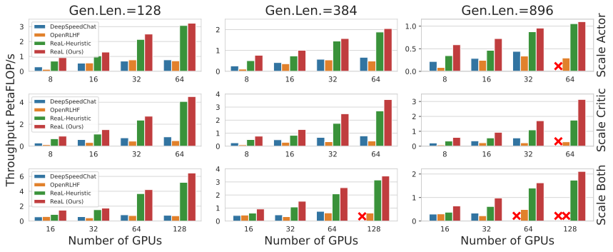

<h1 align="center">
<em>ReaL</em>: Efficient RLHF Training for LLMs  with Parameter Reallocation
</h1>

  <picture>
    <source media="(prefers-color-scheme: dark)" srcset="docs/source/images/real_logo_dark.svg">
    
  </picture>

| <a href="https://openpsi-project.github.io/ReaLRLHF/"><b>Documentation</b></a> | <a href="https://openpsi-project.github.io/ReaLRLHF/"><b>Paper</b></a> |

---

## Introduction

***ReaL*** (the abbreviation for *<ins>ReaL</ins>location*)
is a distributed system for efficient RLHF training with LLMs.
ReaL introduces a novel technique called *parameter reallocation*,
which dynamically moves model parameters among GPUs
and changes the parallel strategies of models
during training.
By tailoring optimized allocations and parallelism degrees for each computation workload,
ReaL can largely reduce the communication overhead caused by parallelization,
meanwhile minimizing the GPU idle time.
This is done automatically by ReaL's customized search engine.

ReaL can achieve substantially higher PPO training throughput than the state-of-the-art
open-source systems.

(In the following figure, with the increased number of GPUs,
we increase the model size from
LLaMA 7B, LLaMA 13B, CodeLLaMA 34B, to the largest LLaMA 70B.)

## Installation and Usage

**We provide hands-on tutorials to use ReaL and reproduce the full procedure of RLHF**
**with 4x LLaMA-7B models within just half an hour!**

Please check our documentation site.

[Documentation](https://openpsi-project.github.io/ReaLRLHF/)

## Acknowledgement

Apart from the authors of our paper,
we thank Shusheng Xu and Jiaxuan Gao from Tsinghua University,
Weilin Liu, Wenjie Ye, and Chuyi He from OpenPsi Inc
for thoroughly testing and using ReaL in their research, 
and for providing valuable suggestions 
that have greatly improved the system during this process.

## Citation

If you find our system useful for your research or production,
please cite our paper.
